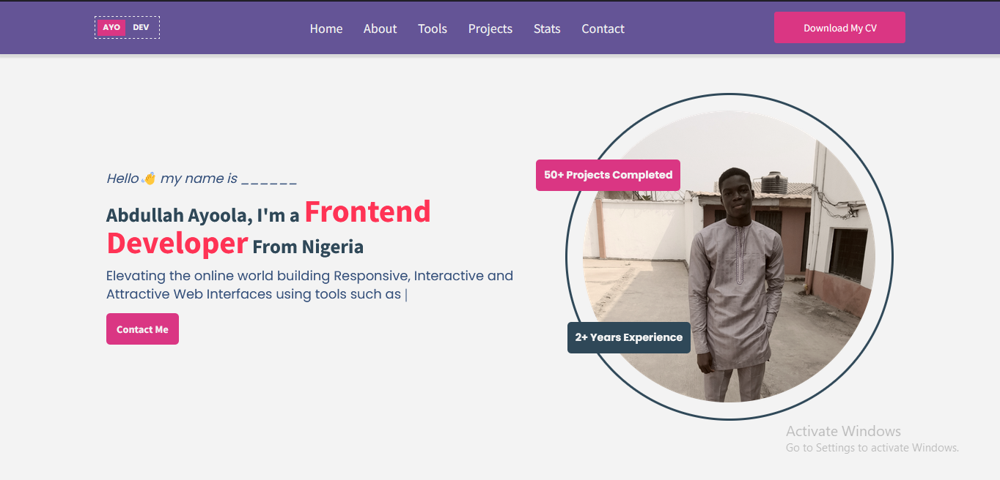
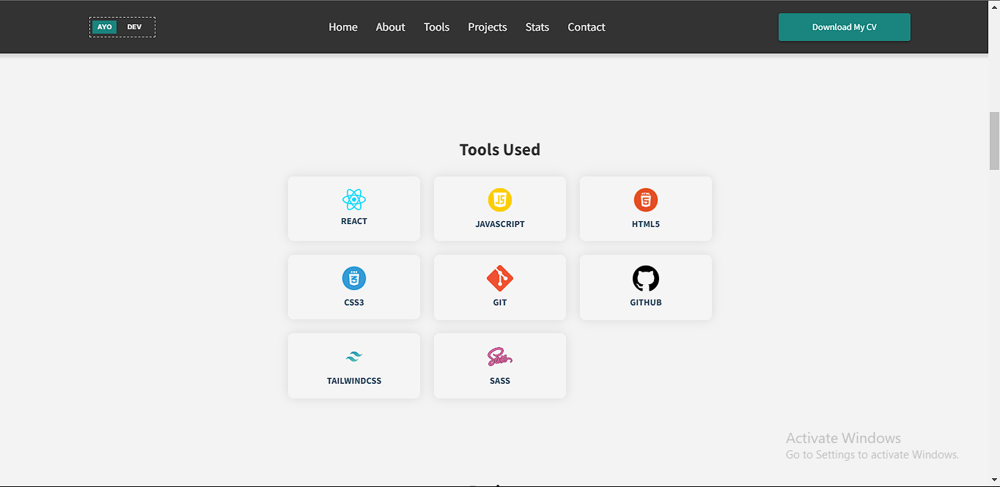
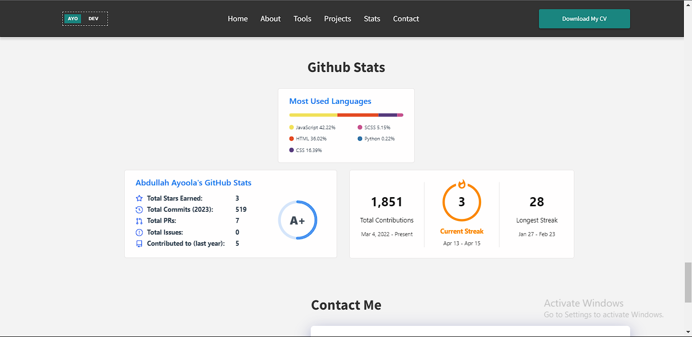

# This Portfolio was built using

- HTML5
- SASS
- Mobile-first workflow
- [TailwindCSS](https://tailwindcss.com/docs/installation) - CSS Framework
- [React](https://reactjs.org/) - JS library
- [Vite](https://vitejs.dev/)

## Screenshots





As always, anytime I work on a project, I learn something new, and this one is no different. I learnt a lot and implemented some of the key things I learnt. I also learnt about animations while building this portfolio which I also implemented. Some of the codes I really loved writing is highlighted below

```js
// revealing navbar when a user scrolls past the about section

useEffect(() => {
  const parent = sectionSlide.current.parentElement.parentElement;
  const navbar = parent.querySelector('.nav');

  const handleScroll = () => {
    if (window.scrollY >= sectionSlide.current.offsetTop) {
      navbar.classList.add('fixedNav');
    } else {
      navbar.classList.remove('fixedNav');
    }
  };

  window.addEventListener('scroll', handleScroll);

  return () => {
    window.removeEventListener('scroll', handleScroll);
  };
}, []);

// My projects dynamically rendered from an external js file created by me

const myProjects = projects.map((project) => {
  return (
    <div key={project.id} className="project mx-auto flex w-full max-w-[400px] cursor-pointer flex-col items-center rounded-2xl bg-glass lg:max-w-[1200px] lg:flex-row lg:rounded-l-2xl">
      <div className="imageContainer relative h-auto w-full cursor-pointer overflow-hidden rounded-t-2xl lg:rounded-l-2xl lg:rounded-r-none">
        
        <div className="cover flex items-center justify-center gap-4 overflow-hidden">
          <a href={project.githubURL} target="_blank">
            <i className="fa-brands fa-github fa-2xl fa-flip text-cta2"></i>
          </a>

          <a href={project.liveURL} target="_blank">
            <i className="fa-solid fa-arrow-up-right-from-square fa-bounce fa-2xl text-cta2"></i>
          </a>
        </div>
      </div>

      <div ref={(ref) => (contentData.current[project.id - 1] = ref)} className="mainContent show w-full p-8">
        <p className="mb-6 text-darkBlue">{project.content}</p>

        <div className="tools-used flex flex-wrap items-center gap-3">
          {project.techStacks.map((techStack, i) => {
            return (
              <div key={i} className={`${techStack.toLowerCase()} cursor-pointer rounded border-dashed border-darkBlue bg-darkBlue px-3 py-2 font-bold text-background hover:border-2 hover:bg-transparent hover:text-cta2`}>
                {techStack}
              </div>
            );
          })}
        </div>
      </div>
    </div>
  );
});
```

```css
/* animation used for the fixed navbar */

.fixedNav {
  position: fixed;
  top: 0;
  left: 0;
  right: 0;
  width: 100%;
  z-index: 9999;
  animation: slideDown 1s ease-in-out;
}

@keyframes slideDown {
  0% {
    transform: translateY(-50px);
  }

  100% {
    transform: translateY(0px);
  }
}
```

There are some other codes like the aboves, but I decided to highlight the ones I love the most. I tried as much as possible to simplify my code, eliminating the need to repeat the same code structure over and over again manually. A good example to take a look at is my
`Projects.jsx`
`Skillset.jsx` files respectively.

After checking out the above files and seeing how I rendered my projects and skills dynamically, it's way easier for me add a new skill to the existing ones without having to write a new code. All I've got to do is to update the js file that has the information holding the skills currently in the page.

## Live URL

You can view the portfolio live via this URL below:
[Click Here](https://ayooladev.netlify.app/)

I'm open to any constructive criticisms you might have on this. I'm always happy learning new ways something might be done in coding. I also love codes that speaks for itself rather than having to break my head trying to understand what does what. Atimes over simplistic codes might become hard to grasp. So atimes I tend to default to an older process of doing something rather than the newer way of doing it.

## REACT REVIEW

### My Take On Learning React So Far

React is absolutely fantastic I must say, and by far, probably the best framework/library any programmer could use in building user interfaces.
When I started learning react newly, I always thought it was uneccessary because, as a beginner you'd feel react only makes building websites a lot more complex compared to the traditional vanilla JS.

Let me show an example; let's imagine we're to build a counter web app of some sort:

Here's the Goal:

- A user must be able to click a button that increments a counter
- The current state of the count process must be reflected in the DOM represented by an element

```html
<!-- setting initial count to zero(0) -->
<p id="counter">0</p>
<!-- btn to increment the count -->
<button>Increment</button>
```

```js
// using vanilla JS
const btnEl = document.querySelector('button');
const counterEl = document.getElementById('counter');

btnEl.addEventListener('click', function () {
  counterEl.textContent = counterEl + 1;
});
```

---

# React Process to solving this

```js
import { useState } from 'react';

export default function Counter() {
  // setting the initial value of the counter to zero(0)
  const [count, setCount] = useState(0);

  const handleIncrement = () => {
    setCount((prevValue) => prevValue + 1);
  };

  return (
    <>
      <p>{count}</p>
      <button onClick={handleIncrement}>Increment</button>
    </>
  );
}
```

Taking a critical look at the code above, you'll notice that the react process is way complicated and probably less understandable at least for a beginner. But the truth is, the react process is way better, and here's why

- Unlike vanilla JS, where you'd have to work with your html and JS file together, using React, you don't have to worry about your html file, because you write your html in your javascript file in a special syntax called `jsx`

- Unlike vanilla JS, where you'd have to select elements manually before you can apply any sort of interactiveness to the element, for example:

```js
const btnEl = document.querySelector('button');
const counterEl = document.getElementById('counter');
```

react doesn't do this, react creates this sort of relationship between it's element nullfying the need to select elements manually. For users who might have run into bugs with selecting elements and it's returning null(selecting elements wrongly), you'd know how using react would save you a torn of effort figuring out why a particular elements is returning null or undefined.

```diff
-<p id="counter">0</p>
-<button>Increment</button>

+<p>{count}</p>
+<button onClick={handleIncrement}>Increment</button>
```

- Unlike most javascript codes you'd see out there, that write their js codes all in one file. This could get a lot more clumpsy over time if the codebase is such a large one. Using react, there's a concept called components. What this means is, you split up your code into several parts to form a whole. This parts you split your code into are called components.

There are so many other benefits of react over vanilla JS that I've discovered over time, and I'm yet to discover it all.

# Finally

I also had to work with [EmailJS](emailjs.com) to implement the contact form submission on the clientSide the docs is user friendly, and I didn't struggle following along. I hope I'd be able to get an job/paid intership position soon enough so that I can pay for this tool, I'm on the free plan which has just 200 email quota. Once that's exhausted then I'd have to result to other options out there.

Well in short, I loved building this portfolio, I'd been procrastinating building this, I kinda felt I wasn't ready to build it yet. But then I also felt I was just wasting too much time in the same state, I had to make progress by moving on, so I got to work and built this. I will most probably be making changes on the UI sometimes in the future when I've learnt some other new things along my journey.

I'd really love it if you let me know what you think about this.
